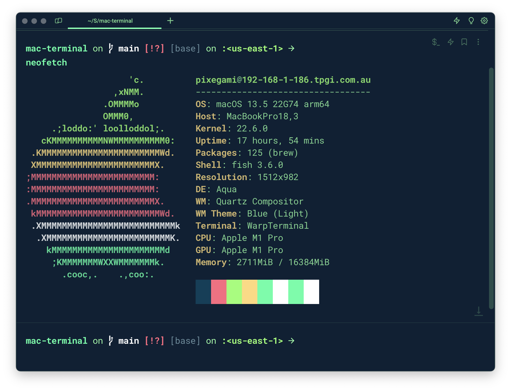

# My MacOS Terminal Setup

This is a guide on how I set up my terminal on MacOS for maximum productivity (mainly for Python and AWS cloud development).



It has three components:

- [Starship (Prompt)](#starship-prompt): The text that is displayed before each command.
- [Fish (Shell)](#fish-shell): The program that runs in the terminal and executes commands (and gives me auto-complete and syntax highlighting).
- [Warp (Terminal App)](#warp-terminal-app): The program that displays the terminal window. It lets me select and edit my commands with the mouse, and also times my commands so I can see how long they take.

It also looks nice. 😄

# [Starship (Prompt)](https://starship.rs/)

The terminal "prompt" is the text that is displayed before each command. It's useful for showing things like the current directory, coding environment, git branch, AWS profile, etc.

[Starship](https://starship.rs/) is a cross-shell prompt that is fast, minimal, and customizable.

```sh
# Install Starship
curl -sS https://starship.rs/install.sh | sh
```

The config file I use is [starship/starship.toml](starship/starship.toml). You should place it in `~/.config/starship.toml`.

```sh
# Copy the config file from this repo.
cp starship/starship.toml ~/.config/starship.toml
```

# [Fish (Shell)](https://github.com/fish-shell/fish-shell)

A shell program is the program that runs in the terminal and executes commands. The default shell on MacOS is Bash. A lot of people also use `zsh`.

But I prefer [Fish](https://fishshell.com/) because it just comes with a lot of nice features out of the box. The ones I use the most are the auto-suggestions and the syntax highlighting.

```sh
# Install Fish
brew install fish
```

```sh
# Make Fish the default shell
chsh -s /usr/local/bin/fish
```

You can also configure `fish` in the `~/.config/fish/config.fish` file. The config file I use is [fish/config.fish](fish/config.fish). It includes a line to use Starship as the prompt.

```sh
# Copy the config file from this repo.
cp fish/config.fish ~/.config/fish/config.fish
```

The disadvantage of Fish is that it's not as widely used as Bash or Zsh. So you might run into some issues with certain commands. Scripts and environment variables are set a little differently.

Fish Tutorial: https://fishshell.com/docs/current/tutorial.html

# [Warp (Terminal App)](https://warp.dev)

A terminal emulator is the program that actually displays the terminal window. The default one on MacOS is called `Terminal.app`.

I prefer [Warp](https://warp.dev) because it has some nice features like tabs, themes, and auto-complete. The best feature is being able to actually select your command with the mouse, and edit it (really useful for long commands).

It's (currently?) free.

```sh
# Install Warp
brew install --cask warp
```

### Font

For fonts and icons to display properly in Starship and in Warp, please get a NerdFont (which has things like icons and emojis built in).

https://www.nerdfonts.com/

I am using `RobotoMono Nerd Font` in Warp.

### Color Scheme

I've got my own color scheme, which I've included in this repo. It's called `warp/px_green.yaml`. You can import it into Warp by creating a theme directory (if you haven't already) and copying the file into it.

```sh
mkdir -p ~/.warp/themes/
cp warp/px_green.yaml ~/.warp/themes/
```

Then you can select it in Warp's settings. Go to `Warp > Settings > Appearance` and click to change the current theme. You might have to reload Warp for it to show up.

If you don't like Warp, then I recommend [iTerm2](https://iterm2.com/) (which I sometimes also use).
